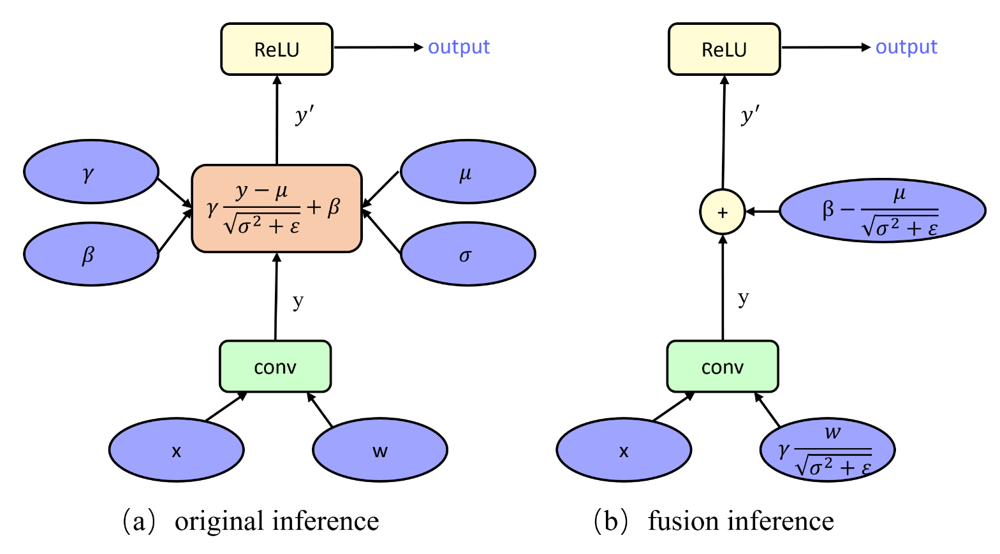
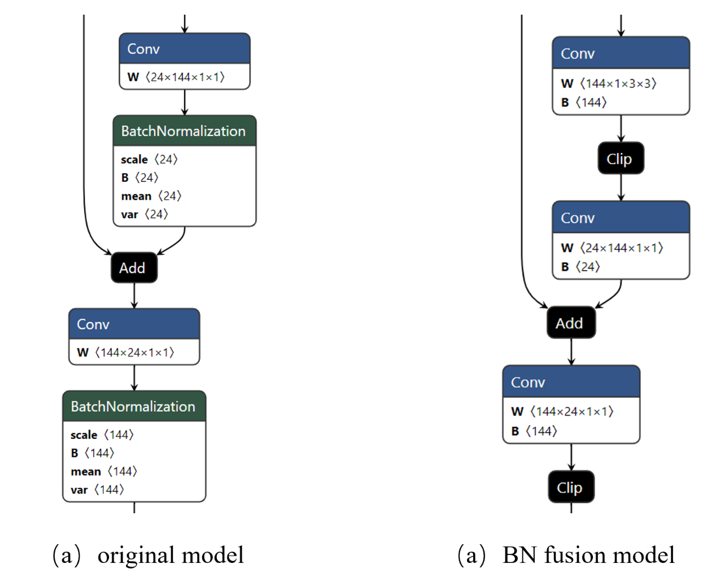

## Batch Normalization Auto-fusion for PyTorch

Batch Normalization fusion is the most common technique in deep learning model compression and acceleration, which could reduce a lot of calculation, and provide a more concise structure for model quantization. However, we could not find a effective and universal method to transform a model with Batch Normalization layer to only-weight-bias model automatically. 



[*](https://github.com/MIPT-Oulu/pytorch_bn_fusion ) is an interesting project to fusion the Batch Normalization layer into the last conv layer for PyTorch. However,  this project was last updated two years ago and it can only be used for layer-to-layer connected model structures, which is not suitable for most current models, especially for the model with add and concatenate ops. Therefore, In order to apply to a wider range of models, we created a new project based on this project. Thanks again to the pioneer work of [MIPT-Oulu](https://github.com/MIPT-Oulu).

First of all, our project cannot be applied to all models. The scope of its application will be explained below, but **it can basically meet all the models supported by the pytorchcv library**. Our team continues to work hard.

### Prerequisites

- torch, torchvision
- pillow
- pytorchcv

### Scope of application

The core idea of our project is to replace the minimal sequence to another sequential. So we must obey the rule: the minimal block of the model is "nn.sequantial", not the custom block, for example:

```
self.block = nn.sequential{
             nn.Conv2d(...),
             nn.BatchNorm2d(...),
             nn.ReLU(...),
             ...
}
```

If the minimal block is a custom block with "add" or "concat" ops, you can find the BN fusion model will lost the ops and generate a miss match results（we provide a visualization method in **main.py**）, because we replace the custom block with "nn.sequential", which do not have "add" or "concat" ops. Then how to solve this problem in an automatic process ? we are working hard on this. 

### Tutorial

- Only one line of code can achieve Batch Normalization fusion automatically. 

  ```
  model_nobn = fuse_bn_recursively(copy.deepcopy(model))
  ```

- results compare

  ```
  output of original model: torch.Size([1, 1000])
  => min : -10.6736, mean : -0.0471 max : 9.6237
  output of BNfusion model: torch.Size([1, 1000])
  => min : -10.6736, mean : -0.0471 max : 9.6237
  ```

### Visualization

- MobileNet-v2, the visualization tool: Netron

  

### Reference

-  https://github.com/MIPT-Oulu/pytorch_bn_fusion 